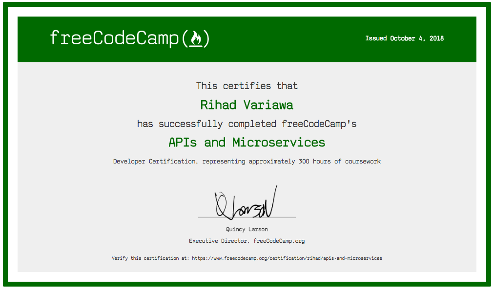

### freeCodeCamp:APIs and Microservices Projects
RIHAD VARIAWA, Data Scientist - Who has fun LEARNING, EXPLORING & GROWING

Timestamp Microservice - https://curse-arrow.glitch.me/api/timestamp/2015-12-25

Request Header Parser Microservice - https://dandelion-roar.gomix.me/api/whoami

URL Shortener Microservice - https://thread-paper.hyperdev.space/api/shorturl/3

Exercise Tracker - https://dev.fitbit.com/build/reference/web-api/activity/

File Metadata Microservice - https://purple-paladin.glitch.me/api/fileanalyse

## Certificate

