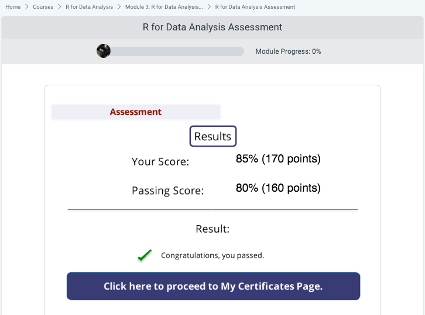

# Description
This course first covers the topic of manipulating and grouping data so you can prepare and organize your output. You then learn how to present this output via visualizations. You also study the important packages such as dplyr, tidyr, readr, data.table, SparkR, and ggplot2 along with how these packages can make data manipulation and computation much faster. The course then shows you the crucial difference between a feature manipualrion and observation manipualtion.

Next, you study the main two types of data visualization. Data visualization is a term that describes any effort to help people understand the significance of data by placing it in a visual context. It exposes patterns, trends and, correlations that might go undetected in text-based data, and makes these patterns more easily recognizable. Finally you learn about the grammar of graphics, the differnece graphing and charting libraries needed for your visualizations, how to set the colours and how to organize data in your visualizations

## Data Manipuation With R
This module begins by introducing you to data manipulation, you will learn about what data manipulation is and what you are trying to get out of it. You will learn about packages or library you need to add to your program for data manipulation. You will learn the difference between feature and observation manipulation. You will learn about grouping and how that can organize your data output.

## Efficiency And Data Visualization Using R
In this module you will be introduced to Data visualization, you will learn about what it is and the two different types of visualization. You will learn about the grammar of graphics. You will learn about different graphing and charting library’s you will need for your visualizations. You will learn about setting the colours and organizing your data in the visualizations.

## Assesssment

## Conclusion
Areas covered in the course: List libraries you will need to include in your analysis for data manipulation - Discuss the process of features and observation manipulation - Describe how the forward pipe operator helps cleans up and organize your code - Explain what data visualization is and the difference between its two types - Describe how to display your data on a visualization.
