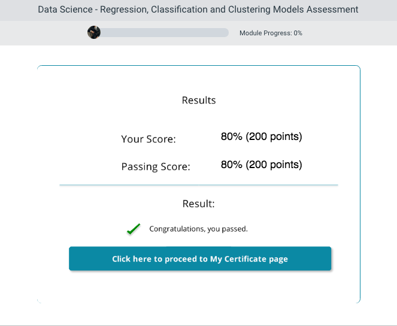

# Description
This course covers the three different types of models in Data Science Course - Regression, Classification and, Clustering Models. These models can be created in Azure ML, R and Python.

The course begins by introducing one to regression models, what regression modelling is, and steps you can take to improve your models. The course teaches you cross-validation and how it can help with your data, using Azure ML’s built-in modules sweep parameters and permutation features.

Next, you taught about classification models, using many of the Azure ML built-in modules for classification models that one can use in regression modelling. One also learns about the metrics for evaluating a classification model’s performance and about creating a support vector machine model and a two-class decision forest model.

Finally, the course teaches about unsupervised learning models, how different closeting methods work and about how to evaluate cluster model. You learn about cluster model’s K-means and hierarchical clustering by creating clustering models in R and Python.

## Regression Modelling
In this module you will be introduced to regression. You will learn about cross-validation and about using Azure ML's built-in modules sweep parameters, and permutation feature.

## Classification Modelling
In this module you will learn about classification modelling. You can use many of same Azure ML built-in modules for classification models that you can use in regression modelling. You will learn about the metrics for evaluating a classification model's performance. You will learn about creating a Support vector machine model and a two-class decision forest model.

## Unsupervised Learning Models
In this module you will learn about unsupervised learning models. You will learn about cluster models K-means and hierarchical clustering. You will learn about how each clustering method works and how to evaluate cluster models. You will learn about creating clustering models in Python and R.

## Assesssment

## Conclusion
Having completed this course one is able to: Discuss the process of regression modelling and how to improve the model - Describe how to refine a regression model with R - Explain how to  refine a  regression model with Python - Discuss the process of classification modelling and how to improve the model - List the metrics for evaluating a classification models performance - Describe how to create a SVM model and a decision forest model - Discuss the process of creating unsupervised learning models - Explain how to create hierarchical and k-means clustering models in R and Python.
