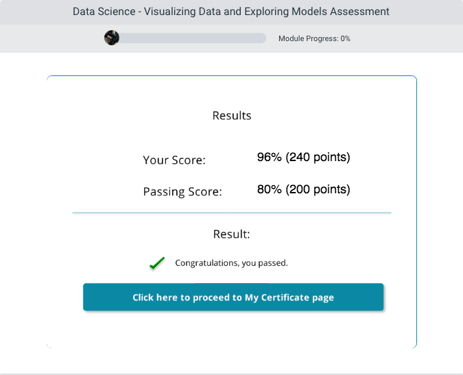

# Description
In the Data science - Visualizing Data and Exploring Models Course, one learns about applying visualizations to data and about feature engineering and constructing machine learning models. 

The course begins by introducing one to exploratory data analysis and data visualization. Learning about functions of exploratory data analysis and what factors can affect your views of data, the different types of charts you can use to visualize your data and, the libraries and packages available in R and Python for visualization. 

Next, you are introduced to building models, including feature engineering and constructing models. THe coures describes what feature engineering is and how to construct a machine learning model in R and Python. You learn about evaluating your model and, how to evaluate a model in Azure ML, R and Python.

## Alison_Visualizing-Data-Exploring-Models
Data Science - Learn data science techniques to apply visualizations to display data, feature engineering methods and construct machine learning models.

## Data Exploration and Visualization
In this module you will be introduced to exploratory data analysis and data visualization. You will learn about the reasons for exploratory data analysis. You will learn about what can affect your views of data. You will learn about the different types of charts you can use to visualize your data. You will learn about the libraries and packages available for R and Python for visualizing your data.

## Building Models In Azure ML
In this module you will be introduced to building models, you will learn about feature engineering and constructing models. You will learn about what feature engineering is and about how to construct and machine learning model. You will learn about creating a machine learning model in R and Python. You will learn about evaluating your model, and why you should evaluate your model. You will learn about evaluating you model in Azure ML, R and Python.

## Assesssment

## Conclusion
Areas covered in the course: Importance of data exploration - What you use for data visualizations in R - What you use for data visualizations in Python - List different types of plots you can use to visualize your data - Discuss the process of feature engineering - Discribe features and methods available in R for creating Machine Learning Models - Describe features and methods available in Python for creating Machine Learning Models - Describe the process and options for evaluating your Machine Learning Models.
