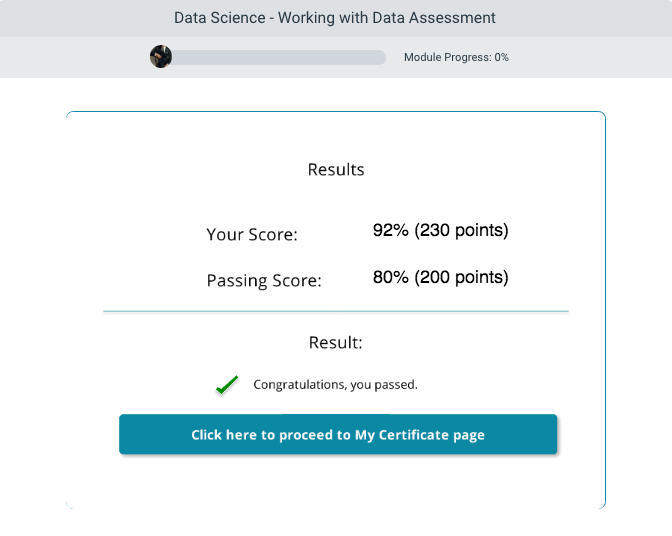

## Description
The course Data Science - Working with Data introduce you to methods for preparing data, data sampling and preparation, how to differentiate between continuous and categorical variables, and what quantization and scaling involve.

You are introduce to the data flow in Azure ML, batch and real time processing and the different types of joins you can use on your data with R and Python.

## Data Acquisition And Programming Languages For Data Science
In this module you will be introduced to the Data flow in Azure ML, you will learn about batch and real time processing. You will learn about different types of joins you can use on your data. You will learn about R and Python programing languages and what they can do for a data science project.

## Data Sampling And Preparation
In this module you will be introduced to Data sampling and Preparation. You will learn about continuous and categorical variables. You will learn what quantization is and can do for your data. You will learn about Data munging and how it’s the most time-consuming part of a data science project. You will learn about handling errors and outliers in your project. You will learn about scaling using either python, R or Azure ML module for scaling.

## Assessment

## Conclusion
Areas covered in the course: Describe the flow of data in Azure ML experiment - Discuss the differences between using R and Python - Identify which programming language suits one better - Describe installing both R and Python in Azure ML environment - Discuss data preparation aka data munging to prepare data for projects - How to deal with missing values in your data set - Describe why you should scale your variables.
