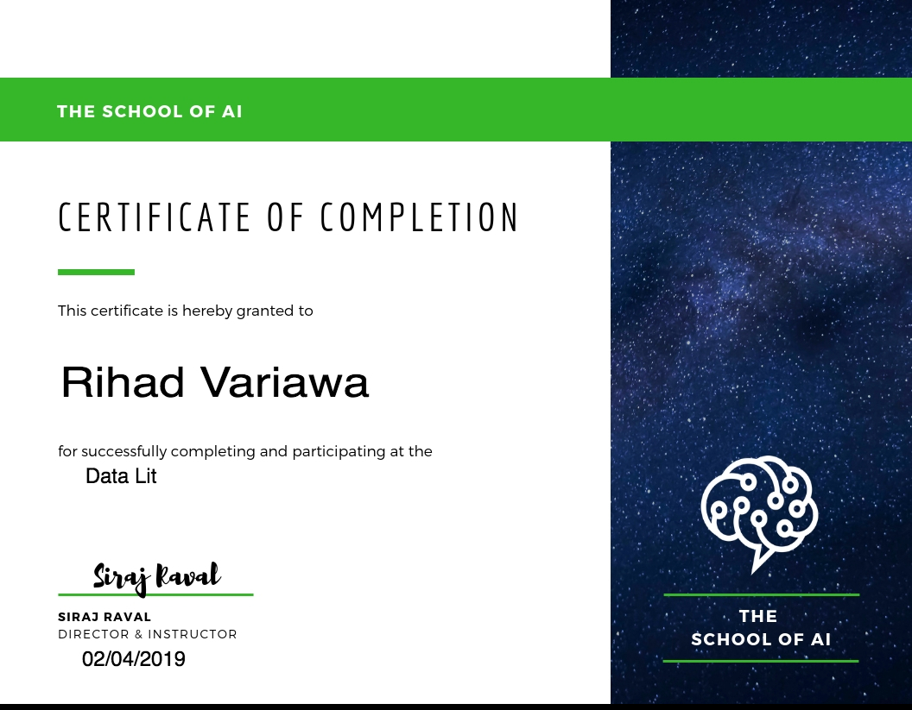

### data_lit
RIHAD VARIAWA, Data Scientist - Who has fun LEARNING, EXPLORING & GROWING

## School of AI

Data Lit is is a 3 month course designed to help absolute beginners become proficient in Data Science. Each week offers lessons on Data Science fundamentals applied to real-world problems that Data Scientists help solve. After completing this course, start applying for jobs, doing contract work, start your own data science consulting group, or just keep on learning. Remember to believe in your ability to learn. You can learn data science, you will learn data science, and if you stick to it, eventually you will master it. This course starts on January 28,2019.  We’re building many, many lectures for each week, expect this curriculum to get much more detailed before the course starts.

### Components
* 2 Projects (1 Midterm + 1 Final)
* 1 Weekly assignment
### Course Length
* 12 Weeks
* 10-15 hours per week

### Tools Used
* Python, SQL, Tensorflow, Hadoop, MapReduce, Spark, GitHub
### Prerequisites 
* Understand basic python syntax
