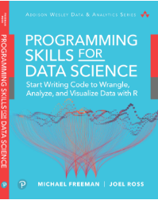

## Programming with R
RIHAD VARIAWA, Data Scientist - Who has fun LEARNING, EXPLORING & GROWING

### The Book Source
<table style="width:100%" >
  <tr>
    <td></td>
  </tr>
</table>

### About the book
Programming Skills for Data Science teaches you how to write code to work with data. Using the R software, you will programmatically work with real datasets to build interactive visualizations, web applications, and well-crafted data reports. All the images below come from exercises in the book's In Action code repository.

 

### Key features
Programming Skills for Data Science is a comprehensive primer for people seeking data science skills that can be applied across a variety of domains. With no background experience required, this text covers the following:

* Install (free) data science software to write, execute, and manage code
* Manage and collaborate on projects efficiently with the version control systems git and GitHub
* Understand the foundational programming concepts and data structures (of the R programming language) for working with quantitative information.
* Load, format, explore, and wrangle data for successful analysis
* Interact with complex data sources, including CSV files, databases, and web APIs
* Design and build interactive visualizations that are accurate, engaging, and intuitive
* Build interactive web applications to facilitate the data science process.

 

### Interactive Web-Applications Build And Deployed

Click the URL to view the app in your browser [diamonds web-app](https://r-variawa.shinyapps.io/diamonds_App/)

Click the URL to view the app in your browser [income growth web-app](https://r-variawa.shinyapps.io/income_growth_App/)

Click the URL to view the app in your browser [electoral college vote web-app](https://r-variawa.shinyapps.io/electoral_college_App/)

