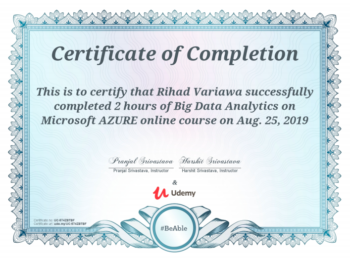

## Udemy: Big Data Analytics on Microsoft AZURE, by Pranjal Srivastava

### Certificate

In this course we explore various Big Data Analytics services available on Microsoft Azure cloud.

We learn about HDInsight, Apache Spark, Jupyter, Zappelin, Stream Analytics, Lake Analytics, Data Bricks.