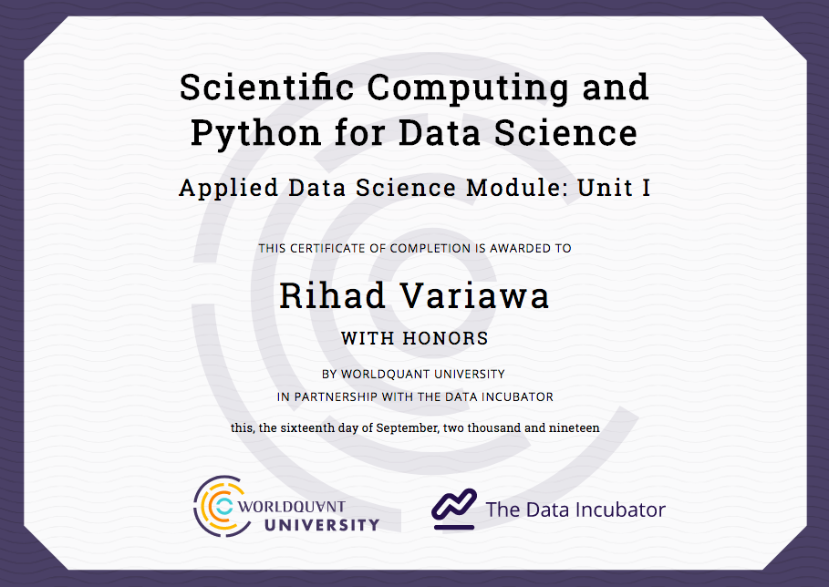

### WorldQuant University: Applied Data Science
RIHAD VARIAWA, Data Scientist - Who has fun LEARNING, EXPLORING & GROWING

### Certificate

[Link](https://wqu.thedataincubator.com/certificate/5518449925160960)

## Onboarding
Thank you for electing to train with WorldQuant and The Data Incubator. Getting logged in here is the important first step. This page provides a central source of information. You can always reach it through the Control Panel button in the top right of every Jupyter server page.

The course is taught through a combination of pre-recorded lecture videos, interactive Jupyter notebooks, and live-streamed office hours. There is a discussion board for additional support. Assignments are provided as interactive Jupyter notebooks connected to an automatic grader. Submitting solutions to the grader in the notebook will update your grades in the gradebook. The highest score you get is the one we save, so don't be afraid to retry problems with other solutions. All of these tools are introduced in this introduction video. We suggest that you follow along with the lecture videos by making notes and experimenting with the code in the notebooks as they are covered in the lectures. You may want to create copies of any notebooks before modifying them so you do not lose the original version.

The buttons above allow you to start, stop, and access your Jupyter server. This server is already provisioned with all of the packages you need for this course, and it allows you to run code directly from your web browser. It can take up to ten minutes for your server to launch. The server will shut itself down if there is no activity for more than 30 minutes.

The tabs below these buttons allow you to see the video schedule, access a shared folder with the videos available for download, see your grades on the miniprojects, and see this information.

## About the Jupyter server
On the Jupyter server page, you can see a listing of all the files in the home directory of your server. All of the material for the training lives within the datacourse/ directory. This contains several directories corresponding with different course modules. Inside the python directory is a miniprojects/ directory, which will have, amongst others, an in.ipynb notebook. Navigate to that directory and open the in.ipynb notebook. Complete this assignment (it should only take a few minutes) and ensure that the grader reports back a score of 1.0.

## Syllabus
The video links tab displays a schedule of lecture videos, giving the pace of the course and an overview of what topics will be covered. While you should defer to the videos for which notebooks are discussed in each lecture, a rough weekly syllabus is as follows. Note that we do not expect you to complete miniprojects in the week that they are assigned! All miniprojects are due by the end of the course.

Programming and Python fundamentals, Data structures (miniproject: in, ip)
Algorithms, object-oriented programming (miniproject: vc)
Pythonic style, Reading and writing data (miniproject: pw)
Python data science packages
Pandas, Intro to statistics (miniproject: dw)
Data munging
SQL & Object-relation mapping

## Discussion Board
This course has a message board for communicating with both the instructors and fellow students located at wqu-ask-ds.tditrain.com

Please use this to chat about problems, course material, or ask questions. Remember, helping your fellow students is a great way to enhance your own understanding of the material.

## About the Data Incubator
The Data Incubator runs a data science fellowship and provides data science training for companies worldwide. Visit our blog, which contains tons of useful resources about the program, including interviews with alumni. For the latest updates to the blog, subscribe to the Twitter feed.
